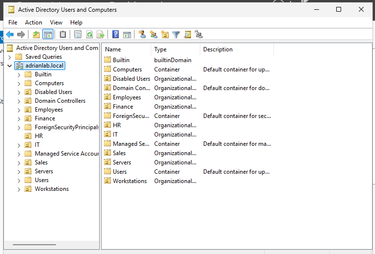
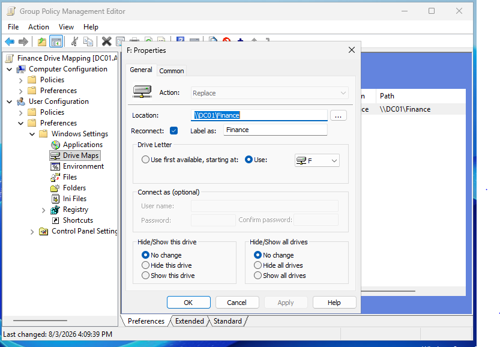

# 🖥️ Windows Active Directory Help Desk Lab Portfolio


> A hands-on Windows Server Active Directory home lab demonstrating real-world Help Desk and Junior Systems Administrator tasks including Active Directory administration, Group Policy, SMB file sharing, NTFS permissions, user provisioning, troubleshooting, and security best practices.

---

## 📑 Table of Contents

- 📖 Project Overview
- 🛠️ Skills Demonstrated
- 🏗️ Lab Environment
- 💻 Technologies Used
- 🌐 Lab Architecture
- 📋 Help Desk Scenarios
- 📸 Screenshots
- 🔒 Security Concepts
- 🎓 Lessons Learned
- 🚀 Future Improvements
- 👨‍💻 About the Author

---

## 📖 Project Overview

This project documents the design, implementation, and troubleshooting of a Windows Active Directory home lab built using **Oracle VirtualBox**, **Windows Server 2025**, **Windows 11 Enterprise**, and **Ubuntu Linux**.

The lab simulates common Help Desk and Junior Systems Administrator responsibilities, including:

- Active Directory administration
- User provisioning and deprovisioning
- Organizational Unit (OU) management
- Security group administration
- SMB file sharing
- NTFS permissions
- Share permissions
- Group Policy configuration
- Drive mapping
- Help Desk troubleshooting
- Root cause analysis

Each scenario includes the original objective, implementation steps, troubleshooting process, verification, and screenshots.

---

## ⭐ Project Highlights

- 🏢 Built a Windows Active Directory domain from scratch.
- 👥 Created and managed Organizational Units (OUs) and security groups.
- 🔐 Implemented Role-Based Access Control (RBAC).
- 💽 Configured SMB file shares with NTFS permissions.
- ⚙️ Automated drive mappings using Group Policy Preferences.
- 👤 Provisioned and deprovisioned user accounts.
- 🔍 Troubleshot authentication, permissions, and network-drive issues.
- 📸 Documented each lab with screenshots and verification steps.
- 📚 Published the project using Git and GitHub.

---

## 🛠️ Skills Demonstrated

| Windows Administration | Networking | Security | Professional Skills |
|------------------------|------------|----------|---------------------|
| Active Directory Users and Computers | SMB File Sharing | NTFS Permissions | Technical Documentation |
| Organizational Units | UNC Paths | Share Permissions | Root Cause Analysis |
| User & Group Management | Drive Mapping | Least Privilege | Troubleshooting |
| Group Policy Management | Network Shares | Role-Based Access Control | Verification Testing |
| Group Policy Preferences | DNS Verification | Authentication | Git & GitHub |

---

## 🏗️ Lab Environment

| Component | Technology |
|-----------|------------|
| Hypervisor | Oracle VirtualBox |
| Domain Controller | Windows Server 2025 |
| Client Workstation | Windows 11 Enterprise |
| Documentation Workstation | Ubuntu Linux |
| Version Control | Git |
| Repository Hosting | GitHub |

---

## 💻 Technologies Used

- Windows Server 2025
- Windows 11 Enterprise
- Ubuntu Desktop
- Oracle VirtualBox
- Active Directory Domain Services (AD DS)
- Group Policy Management
- SMB File Sharing
- NTFS Permissions
- Git
- GitHub

---

## 🌐 Lab Architecture

```text
                          Home Lab

                    Oracle VirtualBox
                          |
        +-----------------+-----------------+
        |                 |                 |
        v                 v                 v
+----------------+ +----------------+ +----------------+
|      DC01      | |    CLIENT01    | |     Ubuntu     |
| Windows Server | | Windows 11     | | Ubuntu Desktop |
|      2025      | | Enterprise     | | Git / GitHub   |
| AD DS and DNS  | | Domain Joined  | | Documentation  |
+--------+-------+ +----------------+ +----------------+
         |
         v
   adrianlab.local
         |
   +-----+------+
   |            |
Finance OU     HR OU
   |            |
Finance_Users  HR_Users
   |            |
Finance Share  HR Share
```

---

## 📋 Help Desk Scenarios

| # | Scenario | Documentation |
|---|----------|---------------|
| 🏗️ | Active Directory Setup | [01 - Active Directory Setup](docs/01-active-directory-setup.md) |
| 🔐 | Account Lockout Troubleshooting | [02 - Account Lockout Troubleshooting](docs/02-account-lockout.md) |
| 📁 | Secure Department File Share | [03 - File Share Permissions](docs/03-file-share-permissions.md) |
| 💽 | Group Policy Drive Mapping | [04 - Group Policy Drive Mapping](docs/04-group-policy-drive-mapping.md) |
| 👤 | User Onboarding | [05 - User Onboarding](docs/05-user-onboarding.md) |
| 🔄 | Department Transfer | [06 - Department Transfer](docs/06-department-transfer.md) |
| 🔍 | Missing Department Drive Troubleshooting | [07 - Missing Department Drive Troubleshooting](docs/07-missing-drive-troubleshooting.md) |
| 🌐 | SMB Share Troubleshooting | [08 - SMB Share Troubleshooting](docs/08-smb-share-troubleshooting.md) |

---

## 📸 Screenshot Gallery

| Active Directory | Group Policy |
|------------------|--------------|
|  |  |

| HR Drive | HR Share |
|----------|----------|
|  |  |

---

## 🔒 Security Concepts

Throughout this project, I implemented and verified several Windows security concepts including:

- 🔐 Least Privilege
- 👥 Role-Based Access Control (RBAC)
- 🛡️ Security Group-Based Authorization
- 📁 NTFS Permissions
- 🌐 SMB Share Permissions
- 💽 Group Policy Preferences
- 👤 User Provisioning
- 🔄 User Deprovisioning
- ✅ Positive and Negative Access Testing

---

## 🎓 Lessons Learned

Building this lab strengthened my understanding of:

- Active Directory administration
- Organizational Unit management
- Security group administration
- Group Policy deployment
- SMB file sharing
- NTFS permissions
- User provisioning and deprovisioning
- Windows authentication
- Windows security tokens
- Help Desk troubleshooting methodology
- Root cause analysis
- Technical documentation
- Git and GitHub portfolio management

This project also reinforced the importance of documenting not only successful configurations but also the troubleshooting process used to identify and resolve problems.

---

## 🚀 Future Improvements

Planned additions include:

- 🔐 Password Policies
- 🛡️ Fine-Grained Password Policies
- 📂 Folder Redirection
- 🖨️ Print Server
- 🌐 DHCP
- 🌍 DNS Administration
- ⚡ PowerShell Automation
- 👤 Bulk User Provisioning
- 🔍 Event Viewer Investigations
- 📜 PowerShell Login Scripts
- 🔑 LAPS (Local Administrator Password Solution)
- 🖥️ WSUS (Windows Server Update Services)
- 📊 Group Policy Security Hardening
- ☁️ Hybrid Microsoft Entra ID Integration

---

## 📊 Repository Statistics

| Category | Count |
|----------|------:|
| Help Desk Scenarios | 8 |
| Documentation Files | 8 |
| Screenshots | Growing |
| Windows Servers | 1 |
| Windows Clients | 1 |
| Linux Systems | 1 |
| Technologies Used | 10+ |

---

## 👨‍💻 About the Author

I created this project to strengthen my Windows Server, Active Directory, Group Policy, and Help Desk troubleshooting skills while building a professional portfolio that demonstrates practical systems administration experience.

Every lab in this repository was completed in a virtualized environment using Oracle VirtualBox and documented with configuration details, troubleshooting procedures, verification steps, and supporting screenshots.

My goal is to continue expanding this repository as I develop additional Windows Server, networking, scripting, and cybersecurity skills.

---

## ⭐ Repository Status

**Current Status:** ✅ Active Development

Completed scenarios:

- ✅ Active Directory Setup
- ✅ Account Lockout Troubleshooting
- ✅ Secure Department File Sharing
- ✅ Group Policy Drive Mapping
- ✅ User Onboarding
- ✅ Department Transfer
- ✅ Missing Department Drive Troubleshooting
- ✅ SMB Share Troubleshooting

Additional enterprise Windows administration projects will be added over time.


