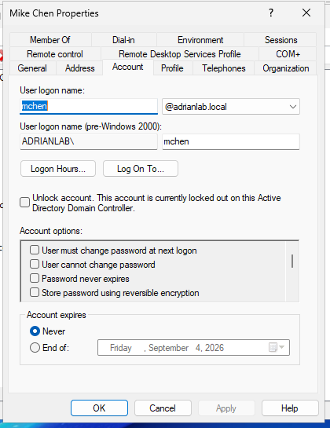

# 🖥️ Windows Active Directory Help Desk Lab

Hands-on Windows Active Directory home lab simulating common **Help Desk and junior Windows system administration tasks**, including user administration, Group Policy, network file sharing, access control, employee lifecycle management, and troubleshooting.

The environment was built using **Windows Server, Windows 11 Enterprise, and Oracle VirtualBox** and documented using **Git, GitHub, and Markdown**.

---

## 🎯 Project Overview

This project was designed to provide practical experience administering and troubleshooting a Windows domain environment.

Rather than stopping after the initial Active Directory configuration, the lab includes realistic support scenarios involving:

- Active Directory user administration
- Account lockouts
- Security groups
- SMB file shares
- NTFS permissions
- Group Policy Preferences
- Mapped network drives
- New employee onboarding
- Department transfers
- Access provisioning and revocation
- Missing drive troubleshooting
- SMB share troubleshooting

Problems were intentionally introduced into the environment and diagnosed using Windows administrative tools and command-line utilities.

---

## 🏗️ Lab Architecture

| Component | Configuration |
|-----------|---------------|
| Domain | `adrianlab.local` |
| Domain Controller | `DC01` |
| Client Workstation | `CLIENT01` |
| Server Platform | Windows Server |
| Client Platform | Windows 11 Enterprise |
| Virtualization | Oracle VirtualBox |
| Finance Share | `\\DC01\Finance` |
| HR Share | `\\DC01\HR` |
| Finance Drive | `F:` |
| HR Drive | `H:` |

### Environment Flow

```text
                 adrianlab.local
                        |
                 +------+------+
                 |             |
                DC01        CLIENT01
                 |
        +--------+---------+
        |                  |
 Active Directory      File Services
        |                  |
   +----+----+        +----+----+
   |         |        |         |
Finance     HR      Finance     HR
Users      Users     Share     Share
   |         |        |         |
   +----+----+        +----+----+
        |                  |
        +--------+---------+
                 |
           Group Policy
                 |
          +------+------+
          |             |
       Finance F:      HR H:
```

---

## 🧰 Technologies Used


- Windows Server
- Windows 11 Enterprise
- Active Directory Domain Services
- Active Directory Users and Computers
- DNS
- Group Policy Management
- Group Policy Preferences
- SMB File Sharing
- NTFS Permissions
- Windows Command Line
- Oracle VirtualBox
- Git / GitHub
- Markdown

---

## 🔐 Access Control Design

Departmental access is based on **Active Directory security-group membership** rather than permissions assigned directly to individual employees.

```text
Employee
   |
   v
Department Security Group
   |
   +----------+----------+
   |                     |
   v                     v
SMB + NTFS          Group Policy
Permissions           Targeting
   |                     |
   v                     v
Department Share     Mapped Drive
```

Examples:

```text
Finance_Users → Finance Share → F:
HR_Users      → HR Share      → H:
```

This model supports **Role-Based Access Control (RBAC)** and the **principle of least privilege**.

---

## 📚 Lab Documentation

| # | Scenario | Documentation |
|---|----------|---------------|
| 01 | Active Directory Environment Setup | [View Lab](docs/01-active-directory-setup.md) |
| 02 | Account Lockout Troubleshooting | [View Lab](docs/02-account-lockout.md) |
| 03 | Secure Finance File Share | [View Lab](docs/03-file-share-permissions.md) |
| 04 | Group Policy Drive Mapping | [View Lab](docs/04-group-policy-drive-mapping.md) |
| 05 | New Employee Onboarding | [View Lab](docs/05-user-onboarding.md) |
| 06 | Employee Department Transfer | [View Lab](docs/06-department-transfer.md) |
| 07 | Missing Mapped Drive Troubleshooting | [View Lab](docs/07-missing-drive-troubleshooting.md) |
| 08 | SMB Share Troubleshooting | [View Lab](docs/08-smb-share-troubleshooting.md) |
| 09 | Complete Project Summary | [View Summary](docs/09-project-summary.md) |

> **Start here:** [Read the complete project summary](docs/09-project-summary.md) for an overview of the architecture, access-control model, troubleshooting scenarios, and lessons learned.

---

## 📸 Project Evidence

### Active Directory Environment

The `adrianlab.local` Active Directory environment used throughout the lab.

[](screenshots/active-directory/aduc-domain-structure.png)

*Active Directory Users and Computers showing the lab domain structure.*

---

### Finance Users and Security Group

Active Directory security groups were used to provide department-based resource access.

[](screenshots/active-directory/finance-users-group.png)

*Finance users and departmental security-group configuration.*

---

### Finance Group Policy Drive Mapping

Group Policy Preferences automatically deployed the Finance F: drive to authorized users.

[](screenshots/group-policy/finance-drive-mapping-gpo.png)

*Finance drive mapping configured through Group Policy Preferences.*

---

### HR Drive Verification

After the appropriate Active Directory and Group Policy configuration was applied, CLIENT01 received the HR H: drive.

[](screenshots/group-policy/hr-mapped-drive.png)

*HR H: drive successfully mapped on CLIENT01.*

---

### HR File Share Verification

The mapped H: drive successfully provided access to the HR departmental files.

[](screenshots/file-sharing/hr-share-files.png)

*HR departmental files accessible through the mapped network drive.*

---

### Account Lockout Troubleshooting

Active Directory Users and Computers was used to identify and resolve an intentionally locked domain account.

[](screenshots/troubleshooting/account-lockout.png)

*Account lockout scenario used to practice domain-user troubleshooting.*

---

## 🔎 Troubleshooting Methodology

A consistent troubleshooting process was used throughout the lab:

```text
Observe
   |
   v
Verify
   |
   v
Isolate
   |
   v
Correct
   |
   v
Retest
```

Examples included:

- Identifying missing security-group membership
- Troubleshooting missing mapped drives
- Verifying Windows security tokens
- Distinguishing Group Policy issues from permission issues
- Identifying a missing SMB share
- Verifying both authorized and unauthorized access

---

## ⌨️ Diagnostic Commands

Common Windows commands used during troubleshooting:

```cmd
whoami
whoami /groups
net use
net view \\DC01
gpupdate /force
```

| Command | Purpose |
|---------|---------|
| `whoami` | Verify the currently authenticated user |
| `whoami /groups` | Inspect security groups in the current Windows token |
| `net use` | Review mapped drives and network connections |
| `net view \\DC01` | Review SMB shares advertised by DC01 |
| `gpupdate /force` | Force Group Policy processing |

---

## 💼 Skills Demonstrated

### Active Directory & Identity

- Active Directory administration
- User account provisioning
- Organizational Unit management
- Security group administration
- Account lockout resolution
- Employee onboarding
- Department transfers
- Access provisioning and revocation

### Windows Administration

- Windows Server administration
- Windows 11 domain clients
- Domain authentication
- Windows security tokens
- DNS-based domain communication
- Command-line diagnostics

### Group Policy & File Services

- Group Policy Management
- Group Policy Preferences
- Item-level targeting
- Mapped network drives
- SMB shares
- NTFS permissions
- Permission inheritance
- UNC path testing

### Troubleshooting

- Root-cause analysis
- Layered troubleshooting
- Positive access testing
- Negative access testing
- Authentication troubleshooting
- Permission troubleshooting
- Mapped-drive troubleshooting
- SMB troubleshooting

### Documentation

- Technical documentation
- Markdown
- Git
- GitHub
- Version control
- Screenshot-based verification

---

## 🧪 Example Help Desk Scenario

**Issue:** An HR employee reports that the H: drive is missing.

**Investigation:**

```cmd
net use
whoami /groups
```

`net use` confirmed that H: was not mapped.

`whoami /groups` showed that the user's current Windows security token did not contain `HR_Users`.

**Root Cause:** The employee was missing the required Active Directory security-group membership.

**Resolution:**

1. Restored `HR_Users` membership in Active Directory.
2. Signed the user completely out of CLIENT01.
3. Signed the user back in to generate a new security token.
4. Refreshed Group Policy.
5. Verified H: returned.
6. Opened the HR share and verified file access.

**Result:** ✅ Resolved

This troubleshooting process is documented in detail in [Lab 07](docs/07-missing-drive-troubleshooting.md).

---

## 🧠 Key Takeaways

This project demonstrated that a simple user-facing issue such as a missing network drive can involve several interconnected technologies:

```text
Active Directory Account
          |
          v
    Security Group
          |
          v
 Windows Security Token
          |
          v
 Group Policy Preference
          |
          v
   SMB Share Permission
          |
          v
    NTFS Permission
          |
          v
   Departmental Files
```

Troubleshooting these issues effectively requires identifying **which layer is failing** rather than immediately changing multiple configurations.

The lab also demonstrated why security-group-based access is more scalable than assigning permissions directly to individual employees.

---

## 🚀 Future Improvements

Planned extensions to this lab include:

- PowerShell Active Directory automation
- CSV-based bulk user provisioning
- Automated group assignments
- Password reset and account-unlock scripts
- Additional Group Policy security configurations
- Windows Server DHCP
- Expanded DNS administration
- Windows Event Viewer troubleshooting
- Centralized logging and monitoring
- Additional Help Desk ticket simulations

---

## 📁 Repository Structure

```text
windows-active-directory-helpdesk-lab/
│
├── README.md
│
├── docs/
│   ├── 01-active-directory-setup.md
│   ├── 02-account-lockout.md
│   ├── 03-file-share-permissions.md
│   ├── 04-group-policy-drive-mapping.md
│   ├── 05-user-onboarding.md
│   ├── 06-department-transfer.md
│   ├── 07-missing-drive-troubleshooting.md
│   ├── 08-smb-share-troubleshooting.md
│   └── 09-project-summary.md
│
└── screenshots/
    ├── active-directory/
    ├── file-sharing/
    ├── group-policy/
    └── troubleshooting/
```

---

## 📌 Project Status

**Status:** Complete — core Active Directory Help Desk lab

The environment remains available for additional Windows administration, PowerShell automation, networking, and security exercises.
