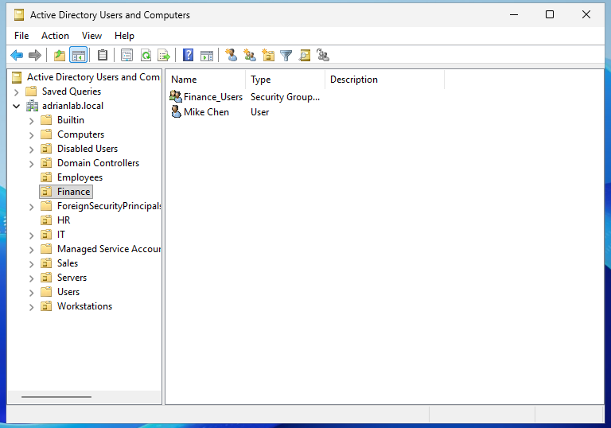

# New Employee Onboarding

## Overview

This exercise demonstrates how Active Directory can be used to provision a new employee with the appropriate domain account and departmental resources.

Emily Rodriguez joined the Finance department and required an Active Directory account, secure first-login credentials, Finance security-group membership, access to the departmental file share, and the automatically deployed Finance F: drive.

---

## Objective

Provision a new Finance employee using Active Directory and verify that existing security-group permissions and Group Policy automatically provide the resources required for the employee's role.

---

## Lab Environment

| Component | Configuration |
|-----------|---------------|
| Domain Controller | DC01 |
| Client Workstation | CLIENT01 |
| Domain | adrianlab.local |
| New Employee | Emily Rodriguez |
| Username | erodriguez |
| Initial Department | Finance |
| Security Group | ADRIANLAB\Finance_Users |
| Finance Share | \\DC01\Finance |
| Finance Drive | F: |

---

## Active Directory Account Creation

A new domain account was created for:

```text
Emily Rodriguez
```

with the username:

```text
erodriguez
```

The account was created in the Finance Organizational Unit using **Active Directory Users and Computers**.

The resulting domain account was:

```text
ADRIANLAB\erodriguez
```

Organizing the employee within the Finance OU provided a logical structure for Active Directory administration.

---

## Initial Password Configuration

A temporary password was assigned when the account was created.

The following option was enabled:

```text
User must change password at next logon
```

This required Emily to replace the administrator-assigned temporary password during her first successful domain login.

The following options were not enabled:

```text
User cannot change password
Password never expires
Account is disabled
```

Requiring a password change at first login helps prevent continued use of credentials initially known by an administrator.

---

## Security Group Assignment

Emily needed the same Finance resources as other employees in the department.

Instead of assigning permissions directly to her individual account, Emily was added to:

```text
ADRIANLAB\Finance_Users
```

The group membership was managed through:

```text
Active Directory Users and Computers
→ Emily Rodriguez
→ Properties
→ Member Of
```

This allowed the existing Finance access-control configuration to be reused for the new employee.

---

## Group-Based Provisioning

The Finance environment had already been configured to use `Finance_Users` for departmental access.

The provisioning model was:

```text
Emily Rodriguez
        |
        v
Finance_Users
        |
   +----+------------------+
   |                       |
   v                       v
SMB + NTFS             GPO Item-Level
Permissions              Targeting
   |                       |
   v                       v
Finance Share           Finance F:
Access                  Drive Mapping
```

Because permissions were assigned to the security group rather than individual employees, no new Finance folder permissions or employee-specific GPO needed to be created.

---

## First Domain Login

Emily signed into the domain-joined CLIENT01 workstation using her new domain account.

The logged-in identity could be verified using:

```cmd
whoami
```

The expected result was:

```text
adrianlab\erodriguez
```

During the initial login process, Windows required the temporary password to be changed.

---

## Group Membership Verification

Emily's current security-group memberships were checked using:

```cmd
whoami /groups
```

The expected Finance membership was:

```text
ADRIANLAB\Finance_Users
```

This command displays the groups contained in the user's current Windows security token and is useful when troubleshooting authorization or Group Policy targeting problems.

---

## Troubleshooting

During initial testing, `Finance_Users` did not appear in the output of:

```cmd
whoami /groups
```

Because the required Finance security group was missing, troubleshooting focused on Emily's Active Directory group membership rather than immediately changing the Finance share, NTFS permissions, or Group Policy configuration.

Emily's account was checked in:

```text
Active Directory Users and Computers
→ Emily Rodriguez
→ Properties
→ Member Of
```

The required Finance membership was corrected so that Emily belonged to:

```text
ADRIANLAB\Finance_Users
```

Emily then completely signed out of CLIENT01 and signed back in.

---

## Windows Security Token

Signing out and back in was an important part of the repair.

Windows creates a security token when a user authenticates. The token contains information used for authorization, including:

- User identity
- Security-group memberships
- Security identifiers
- Authorization information

If Active Directory group membership changes while a user is already signed in, the existing security token may not immediately reflect the new membership.

A fresh login session generated a new token containing Emily's corrected Finance membership.

---

## Troubleshooting Verification

After Emily signed back into CLIENT01, the following command was run again:

```cmd
whoami /groups
```

The output now contained:

```text
ADRIANLAB\Finance_Users
```

**Group Membership Result: ✅ PASS**

This confirmed that Emily's current Windows session recognized the corrected Active Directory membership.

---

## Group Policy Processing

The existing Finance Drive Mapping GPO used item-level targeting based on:

```text
ADRIANLAB\Finance_Users
```

Group Policy could be manually refreshed using:

```cmd
gpupdate /force
```

Once Emily's current security token contained the correct Finance membership, she met the targeting condition for the Finance drive mapping.

---

## Finance Drive Verification

File Explorer was opened on CLIENT01 and the following mapped drive appeared:

```text
Finance (F:)
```

The drive mapped to:

```text
\\DC01\Finance
```

Emily successfully opened the Finance departmental share through the mapped drive.

**Drive Mapping Result: ✅ PASS**

---

## File Access Verification

Emily tested her access by creating a text file in the Finance share.

The test file was:

```text
Emily-Test.txt
```

The file was successfully created and saved.

This confirmed that Emily had the Modify-level access required to work with departmental files.

**File Creation Result: ✅ PASS**

---

## Verification Summary

| Test | Expected Result | Actual Result |
|------|-----------------|---------------|
| Domain account created | Account available | ✅ Pass |
| First-login password change | Password change required | ✅ Pass |
| Finance_Users membership | Membership present | ✅ Pass |
| Domain authentication | Login successful | ✅ Pass |
| Finance F: drive | Drive appears | ✅ Pass |
| Finance share | Share opens | ✅ Pass |
| Emily-Test.txt | File saves successfully | ✅ Pass |

---

## Why Group-Based Access Was Used

Permissions were assigned to:

```text
Finance_Users
```

rather than directly to:

```text
erodriguez
```

This provides a more scalable access-control model.

For future Finance employees, administrators can assign the appropriate resources primarily by adding the employee to the existing Finance security group instead of modifying folder permissions and Group Policy for every new account.

This approach supports **Role-Based Access Control (RBAC)** and simplifies both onboarding and future access changes.

---

## Commands Used

```cmd
whoami
whoami /groups
gpupdate /force
```

---

## Technologies Used

- Windows Server
- Active Directory Domain Services
- Active Directory Users and Computers
- Active Directory Security Groups
- Group Policy Preferences
- SMB File Sharing
- NTFS Permissions
- Windows 11
- Oracle VirtualBox

---

## Skills Demonstrated

- Active Directory User Provisioning
- Employee Onboarding
- Organizational Unit Management
- Security Group Administration
- Temporary Password Management
- Windows Authentication
- Windows Security Token Troubleshooting
- Group Policy Preferences
- Mapped Network Drives
- SMB and NTFS Permissions
- Role-Based Access Control
- Verification and Testing

---

## Screenshots

### Finance User and Security Group Structure

The Finance Active Directory structure demonstrates the security-group model used to provide departmental resources to Finance employees.



*Figure 1. Active Directory Finance users and security-group configuration.*

---

## Lessons Learned

This exercise demonstrated how security-group-based access control can simplify employee onboarding.

Instead of configuring individual permissions for every new employee, existing resources can be associated with departmental security groups. Adding the employee to the appropriate group can then provide access to file shares and targeted Group Policy resources.

The troubleshooting process also demonstrated the importance of Windows security tokens. Correcting Active Directory membership alone may not immediately change the permissions recognized by an existing Windows session. Signing out and back in allows Windows to generate a new security token containing the updated group memberships.

This approach provides a scalable foundation for both employee onboarding and future access management.
