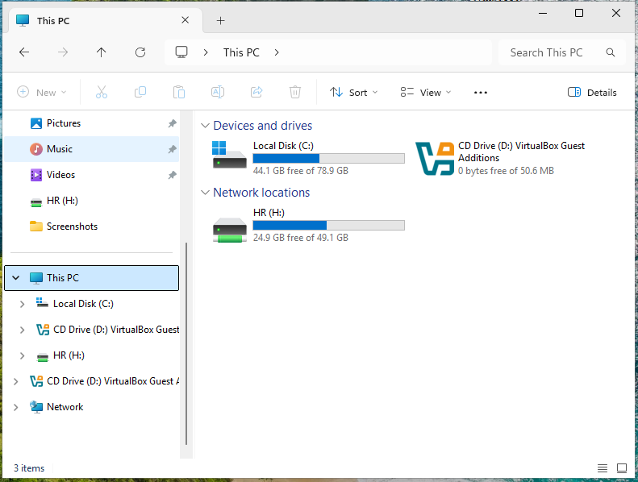
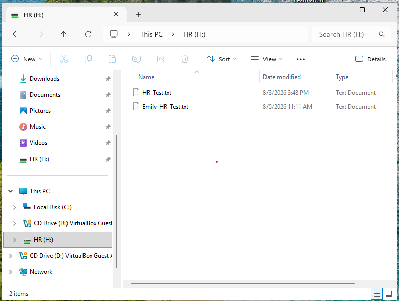

# SMB Share Troubleshooting

## Overview

This exercise demonstrates how to troubleshoot a departmental network share that is no longer available to users even though Active Directory group membership and NTFS permissions are configured correctly.

An HR user reported that the HR network resource was unavailable on CLIENT01. Troubleshooting was performed from both the client workstation and domain controller to determine whether the problem involved connectivity, authentication, permissions, Group Policy, or the SMB share itself.

---

## Objective

Identify why the HR network share was unavailable, restore the server-side SMB share configuration, and verify that authorized HR users could once again access the departmental resource.

---

## Lab Environment

| Component | Configuration |
|-----------|---------------|
| Domain Controller | DC01 |
| Client Workstation | CLIENT01 |
| Domain | adrianlab.local |
| Department | HR |
| Security Group | ADRIANLAB\HR_Users |
| Local Folder | C:\Shares\HR |
| Network Share | \\DC01\HR |
| Mapped Drive | H: |
| Drive Deployment | Group Policy Preferences |

---

## Reported Issue

The HR user could no longer access the departmental network resource.

The expected share was:

```text
\\DC01\HR
```

and the expected mapped drive was:

```text
HR (H:)
```

Because several technologies work together to provide the resource, the issue could potentially involve:

- Network connectivity
- DNS
- User authentication
- Active Directory security-group membership
- Group Policy
- SMB sharing
- NTFS permissions

A layered troubleshooting process was used to isolate the problem.

---

## Troubleshooting Approach

The investigation followed this sequence:

```text
HR Resource Unavailable
        |
        v
Check mapped connections
        |
        v
Check available server shares
        |
        v
Verify AD group membership
        |
        v
Verify NTFS permissions
        |
        v
Inspect SMB share configuration
        |
        v
Restore sharing
        |
        v
Retest from CLIENT01
```

This prevented unnecessary changes to unrelated parts of the environment.

---

## Step 1: Check Current Network Connections

On CLIENT01, the current network connections were reviewed using:

```cmd
net use
```

The HR H: drive was not available as expected.

This established the client-side symptom but did not yet identify the cause.

---

## Step 2: Query Available Network Shares

The following command was used from CLIENT01:

```cmd
net view \\DC01
```

`net view` queries the SMB resources currently being advertised by the remote computer.

The HR share did not appear in the list.

This was an important troubleshooting result.

If the HR folder had been actively published as:

```text
\\DC01\HR
```

it should have appeared among the available shares.

The missing entry shifted the investigation toward the server-side SMB configuration.

---

## Step 3: Verify Security Group Membership

Before changing permissions, the user's current security-group membership was checked using:

```cmd
whoami /groups
```

The user was correctly recognized as a member of:

```text
ADRIANLAB\HR_Users
```

**Security Group Result: ✅ PASS**

Because the required group membership was already present, the issue was unlikely to be caused by Active Directory authorization.

---

## Step 4: Verify the HR Folder

On DC01, the local departmental folder still existed:

```text
C:\Shares\HR
```

The HR data had not been deleted.

This separated the availability of the underlying folder from its availability as a network resource.

---

## Step 5: Verify NTFS Permissions

The HR folder's NTFS permissions were reviewed.

The required HR security group was still configured:

```text
ADRIANLAB\HR_Users
```

with the permissions needed to work with departmental files.

The NTFS configuration was therefore not the root cause.

**NTFS Permission Result: ✅ PASS**

---

## Root Cause

The investigation identified the actual problem:

> The HR folder still existed and had the correct NTFS permissions, but it was no longer published as an SMB network share.

This explained why:

```cmd
net view \\DC01
```

did not display:

```text
HR
```

NTFS permissions alone do not make a folder available across the network.

The folder must also be shared through SMB.

---

## Corrective Action

On DC01, the HR folder was opened at:

```text
C:\Shares\HR
```

The folder's properties were opened and the **Sharing** configuration was reviewed.

Advanced Sharing was used to restore the network share.

The folder was configured as:

```text
Share this folder: Enabled
Share name: HR
```

The resulting UNC path was:

```text
\\DC01\HR
```

---

## Share Permissions

The SMB share permissions were configured for:

```text
ADRIANLAB\HR_Users
```

with the departmental permissions required for normal file access.

Broad access such as:

```text
Everyone
```

was not used to provide departmental authorization.

The HR security group was used instead so access remained based on the employee's role.

---

## SMB and NTFS Permission Layers

Windows network file access depends on two separate permission layers:

```text
User
 |
 v
SMB Share Permissions
 |
 v
NTFS Permissions
 |
 v
HR Files
```

For network access to succeed, the user must satisfy both layers.

In this incident:

```text
NTFS permissions = Correct
SMB share = Missing
```

Therefore, access failed even though the underlying NTFS permissions were valid.

---

## Server-Side Verification

After restoring Advanced Sharing, the available shares were checked again from CLIENT01:

```cmd
net view \\DC01
```

The HR share now appeared in the results.

**SMB Share Verification: ✅ PASS**

This confirmed that DC01 was once again advertising the HR resource over the network.

---

## Direct UNC Path Verification

Before relying on the mapped H: drive, the underlying share was tested directly:

```text
\\DC01\HR
```

The HR folder opened successfully.

Testing the UNC path separately helped verify that SMB access worked independently of Group Policy drive mapping.

**Direct Share Access: ✅ PASS**

---

## Mapped Drive Verification

The Group Policy configuration for the HR drive mapping remained in place.

Group Policy could be refreshed using:

```cmd
gpupdate /force
```

The current network connections were then reviewed using:

```cmd
net use
```

The expected mapping was:

```text
H:    \\DC01\HR
```

File Explorer displayed:

```text
HR (H:)
```

**Mapped Drive Result: ✅ PASS**

---

## File Access Verification

The restored H: drive was opened from CLIENT01.

The departmental test file was available:

```text
HR-Test.txt
```

The successful file access confirmed that:

- The SMB share was active
- The user was authorized
- NTFS permissions were functioning
- The mapped drive pointed to the correct resource

**File Access Result: ✅ PASS**

---

## Verification Summary

| Test | Expected Result | Actual Result |
|------|-----------------|---------------|
| HR folder exists on DC01 | Folder present | ✅ Pass |
| HR_Users membership | Present | ✅ Pass |
| NTFS permissions | Correct | ✅ Pass |
| Initial `net view \\DC01` | HR missing | ✅ Confirmed |
| Advanced Sharing | Restored | ✅ Pass |
| Final `net view \\DC01` | HR appears | ✅ Pass |
| Direct `\\DC01\HR` access | Share opens | ✅ Pass |
| HR H: drive | Available | ✅ Pass |
| HR-Test.txt | Accessible | ✅ Pass |

---

## Why Group Policy Was Not the Root Cause

The missing H: drive could initially appear to be a Group Policy problem.

However, the GPO was configured to map:

```text
H: → \\DC01\HR
```

If the target UNC path itself does not exist as an active SMB share, Group Policy cannot provide a functioning network drive.

The problem was therefore below the Group Policy layer:

```text
Group Policy
     |
     v
H: → \\DC01\HR
          X
     SMB share missing
```

Restoring the underlying SMB share allowed the existing drive-mapping configuration to function again.

---

## Troubleshooting Commands Used

```cmd
net use
net view \\DC01
whoami /groups
gpupdate /force
```

### `net use`

Displays current mapped drives and network connections.

### `net view \\DC01`

Displays SMB shares currently advertised by DC01.

### `whoami /groups`

Confirms the security groups contained in the current user's Windows security token.

### `gpupdate /force`

Forces the client to process the latest Group Policy settings.

---

## Technologies Used

- Windows Server
- Active Directory Domain Services
- Active Directory Security Groups
- SMB File Sharing
- NTFS Permissions
- Group Policy Preferences
- Windows 11
- Windows Command Line
- Oracle VirtualBox

---

## Skills Demonstrated

- SMB Share Administration
- Windows File Server Troubleshooting
- NTFS Permission Verification
- Active Directory Security Groups
- Group Policy Troubleshooting
- UNC Path Testing
- Command-Line Diagnostics
- Layered Troubleshooting
- Root-Cause Analysis
- Access Verification

---

## Screenshots

### HR Mapped Drive

The following screenshot shows the restored HR H: drive on CLIENT01.



*Figure 1. HR H: drive available after the SMB share was restored.*

### HR Share Files

The following screenshot verifies that the restored HR network resource can be opened and its departmental files accessed.



*Figure 2. HR departmental files accessible through the restored network share.*

---

## Lessons Learned

This exercise demonstrated that NTFS permissions and SMB sharing perform different functions in Windows file services.

A folder can exist on the server and have perfectly valid NTFS permissions while still being completely unavailable to network users if it is not published as an SMB share.

The `net view \\DC01` command was particularly useful because it helped determine whether the expected resource was actually being advertised by the server. Once the HR share was missing from that list, troubleshooting could focus on server-side sharing instead of unnecessarily changing Active Directory membership or Group Policy.

The exercise also reinforced the value of testing the underlying resource before troubleshooting higher-level automation. Verifying `\\DC01\HR` directly helped separate SMB access from the H: drive mapping.

The troubleshooting process followed a repeatable methodology:

```text
Observe → Test → Isolate → Correct → Verify
```

Working through the environment layer by layer made it possible to identify the actual root cause while preserving configurations that were already functioning correctly.
