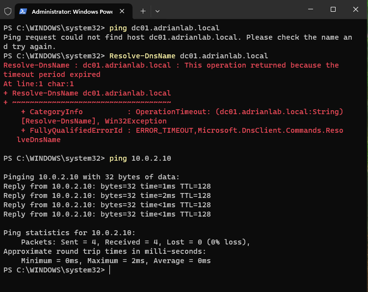
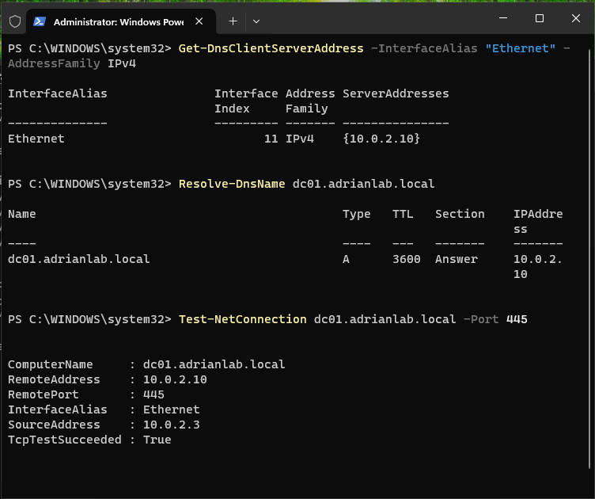
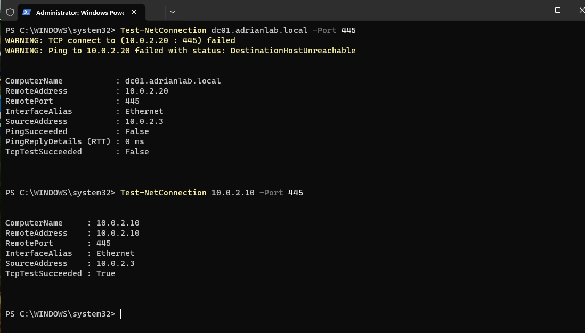
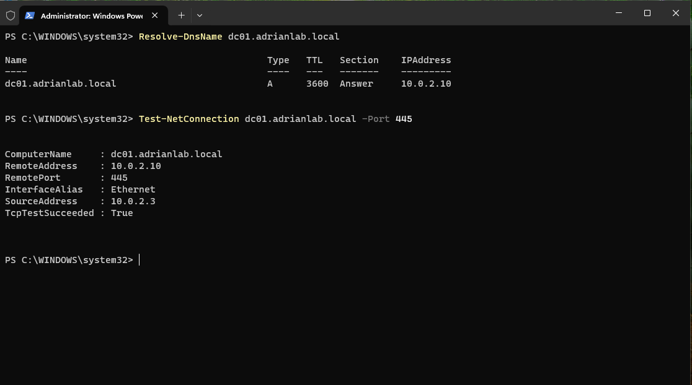
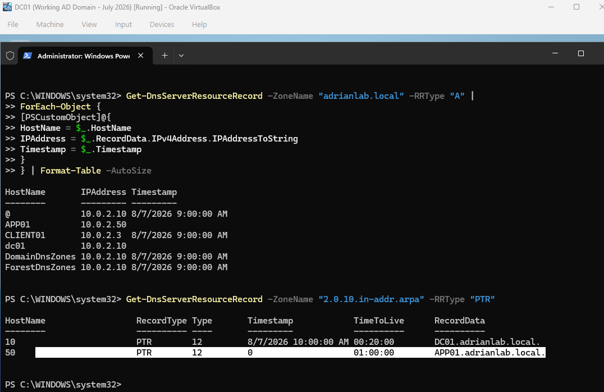

# DNS Administration and Troubleshooting

## Overview

This module extends the Windows Active Directory lab with hands-on DNS administration and troubleshooting.

The environment already relied on DNS for Active Directory domain services, but this phase focused on understanding how DNS works, how Active Directory uses DNS, how to create and remove records, and how to diagnose name-resolution failures.

The lab included both GUI-based DNS administration and PowerShell-based DNS management.

---

## Objectives

The DNS module focused on:

- Inspecting Active Directory-integrated DNS
- Understanding forward and reverse lookup zones
- Working with A, PTR, and SRV records
- Verifying domain-controller discovery
- Testing DNS resolution from CLIENT01
- Distinguishing DNS failures from general network failures
- Troubleshooting incorrect DNS client configuration
- Troubleshooting incorrect DNS records
- Clearing DNS cache
- Creating and removing DNS records with PowerShell
- Auditing DNS records
- Cleaning up temporary DNS entries

---

## Lab Environment

| Component | Configuration |
|-----------|---------------|
| Domain | adrianlab.local |
| Domain Controller | DC01 |
| DC01 IPv4 | 10.0.2.10 |
| Client Workstation | CLIENT01 |
| CLIENT01 IPv4 | 10.0.2.3 |
| DNS Server | DC01 / 10.0.2.10 |
| Forward Lookup Zone | adrianlab.local |
| Reverse Lookup Zone | 2.0.10.in-addr.arpa |

---

## Active Directory DNS Structure

The `adrianlab.local` forward lookup zone contained records and folders such as:

```text
_msdcs
_sites
_tcp
_udp
DomainDnsZones
ForestDnsZones
CLIENT01
DC01
```

These records support both standard hostname resolution and Active Directory service discovery.

---

## Forward DNS Resolution

Forward lookup resolves a hostname to an IP address.

Example:

```text
DC01.adrianlab.local
        |
        v
      DNS
        |
        v
    10.0.2.10
```

The following PowerShell command was used to verify resolution:

```powershell
Resolve-DnsName dc01.adrianlab.local
```

The result confirmed:

```text
DC01.adrianlab.local → 10.0.2.10
```

---

## Active Directory SRV Records

Active Directory uses SRV records to locate services rather than relying only on standard host records.

The following query was used from CLIENT01:

```cmd
nslookup -type=SRV _ldap._tcp.dc._msdcs.adrianlab.local
```

The result identified:

```text
SRV hostname: dc01.adrianlab.local
Port: 389
```

This demonstrated that DNS could identify DC01 as a domain controller providing LDAP services.

---

## Domain Controller Discovery

Windows domain-controller discovery was also tested using:

```cmd
nltest /dsgetdc:adrianlab.local
```

The command successfully identified:

```text
DC01
10.0.2.10
```

This confirmed that CLIENT01 could locate the Active Directory domain controller.

---

## Creating an A Record

A manual DNS A record was created for a test host:

```text
APP01.adrianlab.local
```

with:

```text
10.0.2.50
```

The record represented:

```text
APP01.adrianlab.local → 10.0.2.50
```

This demonstrated that DNS can contain a valid record even if no actual machine exists at that address.

---

## DNS Resolution vs. Network Connectivity

APP01 successfully resolved through DNS:

```powershell
Resolve-DnsName app01.adrianlab.local
```

returned:

```text
10.0.2.50
```

However:

```powershell
Test-NetConnection app01.adrianlab.local
```

reported:

```text
PingSucceeded : False
```

This demonstrated an important troubleshooting distinction:

```text
DNS Resolution      ✅
Network Connectivity ❌
```

A successful DNS lookup does not guarantee that the destination host exists or is reachable.

---

## Reverse Lookup Zone

A reverse lookup zone was created for:

```text
10.0.2.0/24
```

using the reverse-zone name:

```text
2.0.10.in-addr.arpa
```

---

## PTR Record

A PTR record was created for APP01:

```text
10.0.2.50 → APP01.adrianlab.local
```

Reverse resolution was verified using:

```powershell
Resolve-DnsName 10.0.2.50
```

The result returned:

```text
APP01.adrianlab.local
```

This established both forward and reverse DNS resolution.

---

# Troubleshooting Ticket #3002 — Incorrect Client DNS Server

## Reported Issue

A user on CLIENT01 could no longer access DC01 by hostname.

The server had previously been accessible using:

```text
\\DC01\Finance
```

---

## Symptoms

The following tests were performed:

```cmd
ping dc01.adrianlab.local
```

Result:

```text
Ping request could not find host dc01.adrianlab.local
```

Next:

```powershell
Resolve-DnsName dc01.adrianlab.local
```

Result:

```text
DNS request timed out
```

However:

```cmd
ping 10.0.2.10
```

succeeded.

This indicated that network connectivity was working while name resolution was failing.

---

## Diagnosis

CLIENT01's DNS configuration was inspected.

The configured DNS server was:

```text
10.0.2.99
```

The correct Active Directory DNS server was:

```text
10.0.2.10
```

---

## Root Cause

CLIENT01 had been configured to use the wrong DNS server.

This caused name-resolution failures even though the network path to DC01 remained functional.

---

## Resolution

CLIENT01 was corrected using PowerShell:

```powershell
Set-DnsClientServerAddress `
    -InterfaceAlias "Ethernet" `
    -ServerAddresses 10.0.2.10
```

The DNS cache was then cleared:

```powershell
Clear-DnsClientCache
```

---

## Verification

The following tests succeeded after correction:

```powershell
Resolve-DnsName dc01.adrianlab.local
```

returned:

```text
10.0.2.10
```

and:

```powershell
Test-NetConnection dc01.adrianlab.local -Port 445
```

returned:

```text
TcpTestSucceeded : True
```

**Result: ✅ RESOLVED**

---

## Screenshot — Client DNS Misconfiguration



*CLIENT01 could reach DC01 by IP address but could not resolve the server hostname.*

---

## Screenshot — DNS Resolution Restored



*CLIENT01 using the correct DNS server and successfully resolving and reaching DC01 over SMB.*

---

# Troubleshooting Ticket #3003 — Incorrect DNS A Record

## Reported Issue

Users could not reach DC01 using its hostname even though CLIENT01 was configured with the correct DNS server.

---

## Investigation

DNS resolution returned:

```text
dc01.adrianlab.local → 10.0.2.20
```

However, DC01's actual IP address remained:

```text
10.0.2.10
```

---

## DNS Cache Behavior

Initially, CLIENT01 continued to resolve DC01 to the previous correct address.

The client cache was inspected and cleared using:

```powershell
Clear-DnsClientCache
```

After clearing the cache:

```powershell
Resolve-DnsName dc01.adrianlab.local
```

returned:

```text
10.0.2.20
```

This demonstrated how cached DNS records can temporarily hide a DNS change.

---

## Connectivity Testing

Using the hostname:

```powershell
Test-NetConnection dc01.adrianlab.local -Port 445
```

returned:

```text
RemoteAddress    : 10.0.2.20
TcpTestSucceeded : False
```

Testing the known-good DC01 IP directly:

```powershell
Test-NetConnection 10.0.2.10 -Port 445
```

returned:

```text
RemoteAddress    : 10.0.2.10
TcpTestSucceeded : True
```

---

## Root Cause

The DC01 A record was incorrectly configured as:

```text
DC01 → 10.0.2.20
```

instead of:

```text
DC01 → 10.0.2.10
```

The DNS server was functioning correctly but was returning incorrect information.

---

## Resolution

The DC01 A record was corrected in DNS Manager:

```text
10.0.2.20
```

was changed back to:

```text
10.0.2.10
```

CLIENT01's DNS cache was then cleared.

---

## Verification

After correction:

```powershell
Resolve-DnsName dc01.adrianlab.local
```

returned:

```text
10.0.2.10
```

and:

```powershell
Test-NetConnection dc01.adrianlab.local -Port 445
```

returned:

```text
TcpTestSucceeded : True
```

**Result: ✅ RESOLVED**

---

## Screenshot — Incorrect DNS Record



*DNS incorrectly resolved DC01 to 10.0.2.20, causing SMB connectivity to fail while direct access to 10.0.2.10 succeeded.*

---

## Screenshot — Corrected DNS Record



*DC01 resolving to the correct 10.0.2.10 address with successful TCP 445 connectivity.*

---

# PowerShell DNS Administration

## Viewing DNS Zones

DNS zones were listed using:

```powershell
Get-DnsServerZone
```

---

## Viewing DNS Records

Records in the primary zone were inspected using:

```powershell
Get-DnsServerResourceRecord `
    -ZoneName "adrianlab.local"
```

A records were filtered using:

```powershell
Get-DnsServerResourceRecord `
    -ZoneName "adrianlab.local" `
    -RRType "A"
```

---

## Creating an A Record with PowerShell

A temporary WEB01 record was created using:

```powershell
Add-DnsServerResourceRecordA `
    -Name "WEB01" `
    -ZoneName "adrianlab.local" `
    -IPv4Address "10.0.2.60"
```

CLIENT01 verified the record with:

```powershell
Resolve-DnsName web01.adrianlab.local
```

which returned:

```text
10.0.2.60
```

---

## Removing a DNS Record

WEB01 was removed using:

```powershell
Remove-DnsServerResourceRecord `
    -ZoneName "adrianlab.local" `
    -RRType "A" `
    -Name "WEB01" `
    -Force
```

CLIENT01's DNS cache was cleared and resolution was retested.

The lookup failed as expected, confirming successful removal.

---

# DNS Record Auditing

A PowerShell DNS audit was created using:

```powershell
Get-DnsServerResourceRecord -ZoneName "adrianlab.local" -RRType "A" |
ForEach-Object {

    [PSCustomObject]@{
        HostName  = $_.HostName
        IPAddress = $_.RecordData.IPv4Address.IPAddressToString
        Timestamp = $_.Timestamp
    }

} | Format-Table -AutoSize
```

This produced a simplified record inventory containing:

- Host name
- IPv4 address
- Timestamp

Reverse PTR records were audited using:

```powershell
Get-DnsServerResourceRecord `
    -ZoneName "2.0.10.in-addr.arpa" `
    -RRType "PTR"
```

---

## Screenshot — DNS Record Audit



*PowerShell audit of forward A records and reverse PTR records.*

---

# DNS Cleanup

The temporary APP01 record was removed from both forward and reverse DNS.

Forward record:

```powershell
Remove-DnsServerResourceRecord `
    -ZoneName "adrianlab.local" `
    -RRType "A" `
    -Name "APP01" `
    -Force
```

Reverse record:

```powershell
Remove-DnsServerResourceRecord `
    -ZoneName "2.0.10.in-addr.arpa" `
    -RRType "PTR" `
    -Name "50" `
    -Force
```

This demonstrated that DNS cleanup may require reviewing both the forward and reverse zones.

---

## Commands Used

```powershell
Resolve-DnsName
Get-DnsClientServerAddress
Set-DnsClientServerAddress
Clear-DnsClientCache
Test-NetConnection
Get-DnsServerZone
Get-DnsServerResourceRecord
Add-DnsServerResourceRecordA
Remove-DnsServerResourceRecord
```

Additional Windows utilities:

```cmd
nslookup
nltest
ping
ipconfig
```

---

## Skills Demonstrated

- Windows DNS administration
- Active Directory-integrated DNS
- Forward lookup zones
- Reverse lookup zones
- A records
- PTR records
- SRV records
- Domain-controller discovery
- Name-resolution troubleshooting
- DNS client configuration
- DNS cache troubleshooting
- PowerShell DNS administration
- DNS auditing
- Record cleanup
- SMB connectivity testing
- Root-cause analysis
- Verification after remediation

---

## Troubleshooting Methodology

The same structured troubleshooting process used elsewhere in the lab was applied:

```text
Observe
   |
   v
Test
   |
   v
Compare
   |
   v
Isolate
   |
   v
Identify Root Cause
   |
   v
Correct
   |
   v
Verify
```

This helped distinguish between:

```text
DNS failure
Network failure
Service failure
Incorrect DNS data
Incorrect client configuration
```

rather than treating every hostname-access problem as the same issue.

---

## Lessons Learned

This module demonstrated how dependent Active Directory is on DNS.

A workstation may still have basic IP connectivity while domain functionality fails because DNS cannot locate the required systems or services.

The troubleshooting exercises also demonstrated that similar user-facing symptoms can have very different causes. One incident was caused by an incorrect DNS server configured on CLIENT01, while another was caused by an incorrect A record stored on the DNS server itself.

PowerShell provided an additional administrative layer for querying, creating, removing, and auditing DNS records.

The module reinforced the importance of verifying both the DNS configuration and the data returned by DNS before changing unrelated network or Active Directory settings.
